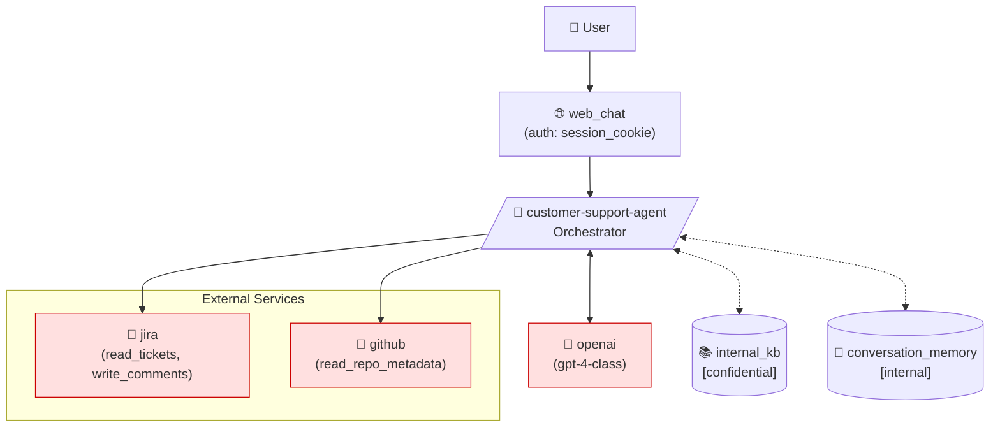

# Aesop

**Threat modeling for AI agents, LLM apps, and RAG systems.**

A developer-first CLI that analyzes AI system architectures for security risks using deterministic rules and MITRE ATLAS-inspired technique mappings. No LLM required — just YAML in, threat model out.

---

## What is Aesop?

Aesop is a command-line threat modeling tool built for modern AI systems. You describe your architecture in a simple YAML file, and Aesop produces a structured threat model with severity-scored findings, traceable evidence, MITRE ATLAS technique mappings, and actionable mitigations.

Every finding is **deterministic** — the analysis engine uses rule-based detection, not an LLM, so results are reproducible, explainable, and auditable.

Aesop supports terminal, Markdown, and JSON output, generates Mermaid architecture diagrams, and can diff two versions of a spec to show how your security posture changed between releases.

## Why Aesop?

Traditional threat modeling tools were designed for conventional software architectures. They don't account for the risks that are specific to AI-powered systems:

- **LLM agents can be manipulated.** Prompt injection lets attackers override system instructions through user input. When that agent has tool access, the blast radius expands to every connected service.
- **RAG pipelines can leak.** Retrieval-augmented systems pull from knowledge bases that may contain confidential data, PII, or restricted documents. Without access controls at the retrieval layer, sensitive content ends up in LLM responses.
- **Persistent memory can be poisoned.** Agents with memory can have their future behavior altered by malicious interactions today. Cross-user memory contamination is a real risk in shared deployments.
- **Secrets flow through new paths.** API keys and tokens used for tool connectors, model providers, and external services can leak through prompts, error messages, and logs in ways traditional secret scanning doesn't catch.
- **Every integration expands the attack surface.** External model providers, third-party tools, and cross-boundary services create transitive trust relationships that compound risk.

Aesop gives developers a structured way to identify these risks early, in the same workflow they use to design the system — before code is written.

### Why deterministic?

LLM-based security analysis can hallucinate threats, miss obvious risks, and produce different results on every run. Aesop's rule engine is fully deterministic: same input, same findings, every time. Findings are traceable to specific spec evidence, making them reviewable and actionable.

### Why CLI-first?

Threat modeling should fit into developer workflows, not require a separate web dashboard. Aesop runs locally, works offline, and integrates naturally into code review and CI/CD pipelines.

## Features

- **Four core commands** — `validate`, `model`, `diff`, `export`
- **Deterministic analysis** — no LLM required, fully offline, reproducible results
- **12 built-in threat rules** — prompt injection, tool abuse, retrieval exfiltration, secret exposure, memory abuse, supply chain, insecure output handling, excessive agency, cross-context isolation, logging leakage, DoS/cost abuse, missing approval gates
- **MITRE ATLAS mapping** — findings linked to a curated subset of ATLAS techniques
- **Multiple output formats** — Rich terminal, Markdown reports, JSON for automation
- **Mermaid diagrams** — architecture visualization with trust boundary highlighting
- **Architecture diffing** — compare two spec versions to detect security posture changes
- **Context-aware severity scoring** — severity adjusts based on exposure, data sensitivity, and system complexity
- **Explainable findings** — every finding includes evidence, attack paths, affected components, and mitigations

## How It Works

1. **Describe** your AI system in a YAML spec — components, tools, retrieval sources, memory, secrets, trust boundaries
2. **Validate** the spec against the schema to catch structural issues early
3. **Normalize** the architecture into a flattened model optimized for rule evaluation
4. **Analyze** using deterministic rules that evaluate the normalized model and emit findings
5. **Map** findings to MITRE ATLAS techniques for standardized threat categorization
6. **Score** severity based on system-level risk factors (exposure, data sensitivity, tool privileges)
7. **Report** in your preferred format — terminal summary, Markdown report, JSON, or Mermaid diagram

## Installation

Aesop uses [uv](https://docs.astral.sh/uv/) for dependency management.

```bash
git clone https://github.com/muhammedcan/aesop.git
cd aesop

uv sync

uv run aesop --help
```

## Quick Start

### Validate a spec

```bash
uv run aesop validate examples/simple_agent.yaml
# ✓ Specification customer-support-agent (llm-agent) is valid.
```

### Generate a threat model

```bash
# Rich terminal output (default)
uv run aesop model examples/simple_agent.yaml

# Markdown report
uv run aesop model examples/simple_agent.yaml --format markdown --output report.md

# JSON report for automation
uv run aesop model examples/simple_agent.yaml --format json --output report.json

# Include architecture diagram
uv run aesop model examples/simple_agent.yaml --format markdown --diagram --output report.md

# Show only high and critical findings
uv run aesop model examples/simple_agent.yaml --min-severity high
```

### Compare two spec versions

```bash
uv run aesop diff examples/diff_old.yaml examples/diff_new.yaml
```

### Export multiple artifacts at once

```bash
uv run aesop export examples/simple_agent.yaml \
  --markdown report.md \
  --json report.json \
  --mermaid diagram.mmd
```

## Example YAML Spec

```yaml
system:
  name: customer-support-agent
  type: llm-agent
  description: AI support assistant with retrieval and tool access

exposure:
  internet_facing: true
  users:
    - external_customers
    - internal_support_team

model:
  provider: openai
  model_family: gpt-4-class
  hosted: external_api

interfaces:
  - type: web_chat
    auth: session_cookie

tools:
  - name: jira
    permissions:
      - read_tickets
      - write_comments
    trust_boundary: external_service
  - name: github
    permissions:
      - read_repo_metadata
    trust_boundary: external_service

retrieval:
  enabled: true
  sources:
    - name: internal_kb
      sensitivity: confidential

memory:
  enabled: true
  stores:
    - type: conversation_memory
      sensitivity: internal

secrets:
  - name: openai_api_key
    scope: backend
  - name: github_token
    scope: tool_connector

data:
  sensitivity:
    - internal
    - confidential
    - pii

trust_boundaries:
  - browser
  - backend
  - external_llm_provider
  - external_tools
  - internal_knowledge_base
```

<details>
<summary><strong>Supported system types</strong></summary>

| Type | Description |
|------|-------------|
| `llm-agent` | LLM-powered agent with tool access |
| `rag-system` | Retrieval-augmented generation system |
| `multi-agent` | Multi-agent orchestration |
| `chat-assistant` | Conversational assistant |
| `tool-agent` | Tool-focused automation agent |
| `custom` | Other AI systems |

</details>

<details>
<summary><strong>Supported data sensitivities</strong></summary>

`public` · `internal` · `confidential` · `pii` · `restricted`

</details>

## Built-in Threat Rules

Aesop ships with 12 deterministic threat detection rules. Each rule evaluates architecture-observable conditions — no guesswork, no LLM inference. Same input produces the same findings every time.

| Rule | ID | Triggers When |
|------|----|---------------|
| **Prompt Injection** | `AESOP-PI` | Internet-facing system accepts untrusted input with LLM processing; escalates with tool or retrieval access |
| **Tool Abuse** | `AESOP-TA` | Tools have write or privileged permissions; tool actions cross trust boundaries |
| **Retrieval Exfiltration** | `AESOP-RE` | Retrieval sources contain confidential, PII, or restricted data; external users can query |
| **Secret Exposure** | `AESOP-SE` | Secrets exist in the system; tool connector credentials bridge to external services |
| **Memory Abuse** | `AESOP-MA` | Persistent memory enabled; no isolation metadata declared; external users share the system |
| **Supply Chain Risk** | `AESOP-SC` | External model provider; tools cross trust boundaries; complex boundary topology |
| **Insecure Output Handling** | `AESOP-IO` | Model output drives write-capable tools or crosses trust boundaries without validation |
| **Excessive Agency** | `AESOP-EA` | Multiple write-capable tools; privileged cross-boundary access; disproportionate agent authority |
| **Cross-Context Isolation** | `AESOP-CC` | Shared memory or retrieval across external users; no per-user isolation declared |
| **Logging / Telemetry Leakage** | `AESOP-LL` | Secrets or confidential retrieval content may be exposed through logs or telemetry |
| **DoS / Cost Abuse** | `AESOP-DC` | Public-facing system with external model provider; multi-step workflows amplify cost |
| **Missing Approval Gates** | `AESOP-MG` | Write-capable or privileged tools with no declared approval, confirmation, or policy enforcement |

Each rule emits one or more findings depending on the specific conditions detected. All findings include evidence, attack paths, and mitigations.

Rules are self-registering modules — adding a new rule means creating a file, extending `BaseRule`, and calling `register()`. No changes to existing code required.

## Example Finding

Here's what a real finding looks like in Aesop's Markdown output:

> ### 🔴 CRITICAL — Prompt Injection via Untrusted Input
>
> **ID:** `AESOP-PI-001` · **Rule:** `AESOP-PI` · **Confidence:** high
>
> The system accepts input from untrusted users and processes it through an LLM, creating prompt injection risk.
>
> An attacker can craft input that overrides system instructions, extracts sensitive context, or triggers unintended actions. This risk increases when the LLM has access to tools or retrieval sources that can act on injected instructions.
>
> **Affected components:** user_input, llm_orchestrator
>
> **Evidence:**
> - System is internet-facing
> - External users: external_customers, internal_support_team
> - Tools available: jira, github
> - Retrieval sources: internal_kb
>
> **Attack path:** Untrusted user → web interface → LLM prompt → instruction override → unauthorized action
>
> **ATLAS techniques:**
> - `AML.T0051` — LLM Prompt Injection
> - `AML.T0052` — Indirect Prompt Injection
> - `AML.T0054` — Unsafe Action Chain
>
> **Mitigations:**
> - Implement input validation and sanitization
> - Use system prompt hardening techniques
> - Apply output filtering before tool execution
> - Enforce least-privilege on tool permissions
> - Monitor for anomalous prompt patterns

## Example Diff Output

When you compare two versions of a spec, Aesop shows exactly what changed and how it affects your security posture:

```bash
uv run aesop diff examples/diff_old.yaml examples/diff_new.yaml
```

```
┌─────────────────────────────────────┐
│  Aesop Architecture Diff            │
│  support-agent → support-agent      │
└─────────────────────────────────────┘

  Component Changes
┌──────────────────────┬──────────────────────────┐
│ Change               │ Details                  │
├──────────────────────┼──────────────────────────┤
│ Tools added          │ slack                    │
│ Retrieval added      │ help_center, customer_…  │
│ Memory added         │ conversation_memory      │
│ Secrets added        │ jira_token, slack_token   │
│ Boundaries added     │ browser, external_tools   │
│ Exposure changes     │ Internet exposure enabled │
└──────────────────────┴──────────────────────────┘

  Severity Changes
  • CRITICAL findings increased: 0 → 3
  • HIGH findings increased: 1 → 8

  New Findings
  🔴 CRITICAL  Prompt Injection via Untrusted Input (AESOP-PI-001)
  🔴 CRITICAL  Sensitive Knowledge Disclosure via Retrieval (AESOP-RE-001)
  🟠 HIGH      Tool-Triggered Unsafe Action Chain (AESOP-PI-002)
  🟠 HIGH      Write-Capable Tools Crossing Trust Boundaries (AESOP-TA-001)
  🟠 HIGH      Memory Poisoning via Untrusted Input (AESOP-MA-001)
  ...
```

This makes `aesop diff` useful for pull request review — run it on the old and new version of your architecture spec to catch security regressions before they ship.

## Example Mermaid Diagram



## Architecture

```
aesop/
├── cli/               # Typer commands and terminal UX
│   ├── app.py             # CLI entrypoint and command registration
│   ├── common.py          # Shared error handling and output helpers
│   └── commands/          # validate, model, diff, export
├── core/              # Analysis engine
│   ├── parser.py          # YAML parsing + Pydantic validation
│   ├── normalizer.py      # ArchitectureSpec → NormalizedSystem
│   ├── analyzer.py        # Orchestrates parse → normalize → rules → score → map
│   ├── scoring.py         # Context-aware severity adjustment
│   ├── diff_engine.py     # Architecture comparison and finding delta
│   └── diagrams.py        # Mermaid diagram generation
├── domain/            # Data models (no logic)
│   ├── enums.py           # Severity, Confidence, SystemType, etc.
│   ├── models.py          # Pydantic input spec (YAML schema)
│   ├── normalized.py      # Flattened analysis model with derived properties
│   └── findings.py        # Finding, AnalysisResult, SeveritySummary
├── rules/             # Threat detection rules (12 built-in)
│   ├── base.py            # BaseRule abstraction
│   ├── registry.py        # Auto-discovery and execution
│   ├── prompt_injection.py
│   ├── tool_abuse.py
│   ├── retrieval_exfiltration.py
│   ├── secret_exposure.py
│   ├── memory_abuse.py
│   ├── supply_chain.py
│   ├── insecure_output.py
│   ├── excessive_agency.py
│   ├── cross_context.py
│   ├── logging_leakage.py
│   ├── dos_cost_abuse.py
│   └── missing_approval.py
├── atlas/             # MITRE ATLAS integration
│   ├── catalog.py         # Technique loader (from local JSON)
│   ├── mapper.py          # Finding → ATLAS technique enrichment
│   └── data/
│       └── atlas_minimal.json  # Curated technique subset
├── reports/           # Output rendering (separated from analysis)
│   ├── terminal.py        # Rich terminal output
│   ├── markdown.py        # Markdown report generation
│   ├── json_report.py     # JSON report generation
│   └── sections.py        # Shared report helpers
└── utils/             # Infrastructure
    ├── errors.py          # Custom error hierarchy
    ├── io.py              # File read/write helpers
    └── logging.py         # Console configuration
```

### Design Principles

- **Deterministic** — no LLM calls, no network access, no randomness
- **Explainable** — every finding traces back to evidence in the spec
- **Extensible** — add a rule by creating one file and calling `register()`
- **Separated concerns** — parsing, normalization, analysis, scoring, mapping, and rendering are independent layers
- **Offline-first** — works without any external services or API keys

## Running Tests

```bash
uv run pytest             # run all tests
uv run pytest -v          # verbose output
uv run pytest tests/test_analyzer.py   # specific test file
```

Test coverage includes YAML parsing, schema validation, normalization, all 12 rule modules, severity scoring, architecture diffing, and CLI integration.

## Roadmap

- [ ] Additional rules — data poisoning, output manipulation, model theft
- [ ] SARIF output for IDE and CI/CD integration
- [ ] Custom rule authoring via YAML definitions
- [ ] Full MITRE ATLAS dataset sync
- [ ] GitHub Actions integration for automated spec review
- [ ] Policy-as-code enforcement (pass/fail on severity thresholds)

## Limitations

- Aesop uses a **curated subset** of MITRE ATLAS, not the full dataset. Technique IDs follow ATLAS conventions but are locally defined for the MVP.
- Rules are **heuristic-based**. They analyze declared architecture, not running systems — so they can flag risks that are already mitigated in implementation, and they can't detect issues not described in the spec.
- Severity scoring is **context-aware but approximate**. It adjusts based on system exposure and data sensitivity, but it does not model attacker capability or exploit likelihood.
- There is no dynamic analysis, code scanning, or network probing. Aesop is a **static architecture analysis tool**.

## Disclaimer

Aesop findings assist human security review and do not replace formal security assessment. The tool provides structured, deterministic analysis to support threat modeling workflows — all findings should be reviewed by qualified security professionals before acting on them.

## Author

**Muhammed Can**

## License

[MIT License](LICENSE) — Copyright (c) Muhammed Can
